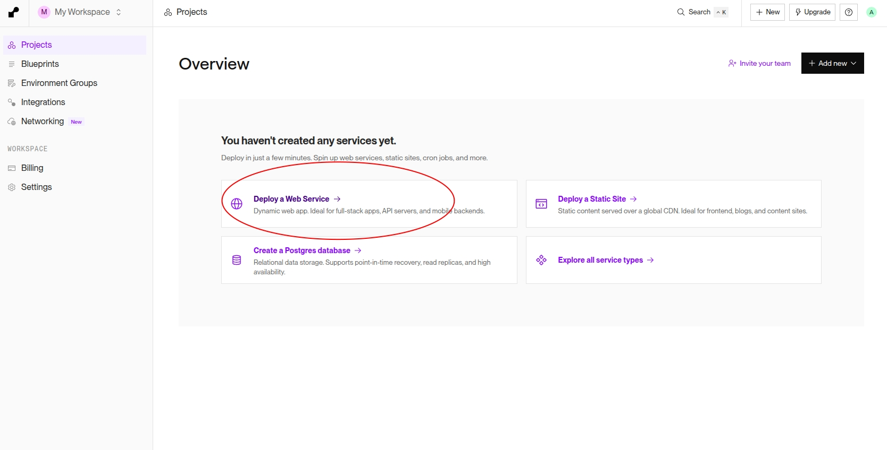
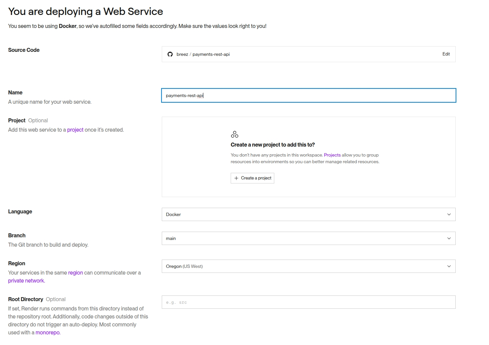
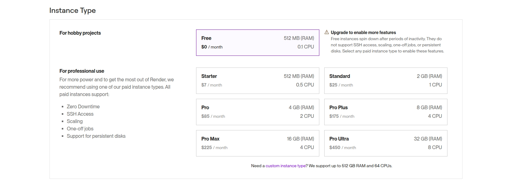
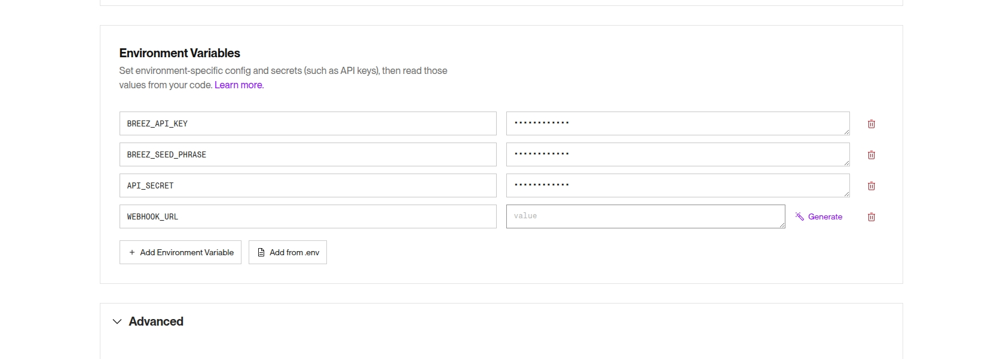
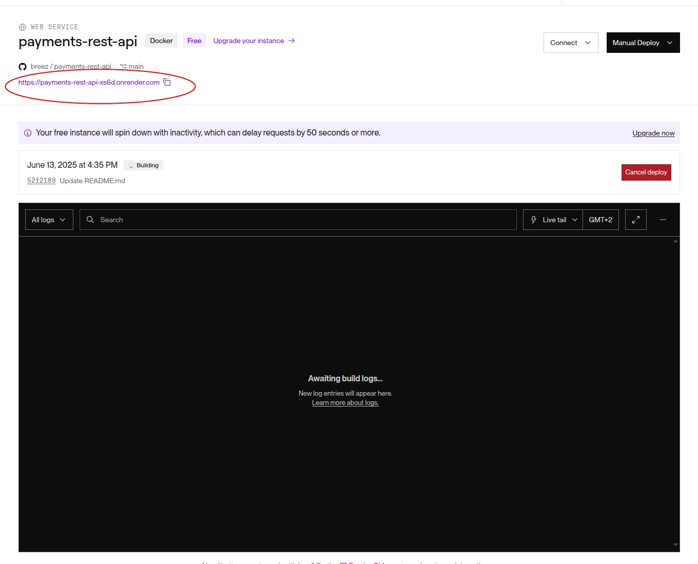

## Deployment to render.com
This document explains deploying breez payments api to render.com

## Prerequisites

- [Breez Nodeless SDK API key ](https://breez.technology/request-api-key/#contact-us-form-sdk)
- 12 words BIP 39 seed (you can use [Misty Breez](https://github.com/breez/misty-breez) to generate it)
- [Render account](https://render.com/)
- api key that you will use for accessing the API (see [API Key Security](../README.md#api-key-security)). You can use generators like [this](https://1password.com/password-generator) or [this](https://www.uuidgenerator.net/).

## Installation
Click on **Deploy new service** button in the top right corner of the [Render dashboard](https://dashboard.render.com/).

Select **Public Git Repository** and enter the repository URL: `https://github.com/breez/payments-rest-api`)
![[render1.jpg]](./images/render1.jpg)

You can select your preferred region for deployment:

Select **Instance type**, use `Free` for free deployment that should be enough for small usage:

Configure the **Environment** with the :

After you've verified that you've correctly set the Environment variables, you are ready to click **Deploy Web Service** button to start the deployment.

You will see a screen like this. The circled url (yours will be different) is the url of your newly deployed Breez Payments API instance:

